# ALU 8 bits

Desenvolvimento de uma ALU (Unidade Lógica e Aritmética) de 8 bits desenvolvida no software [Digital](https://github.com/hneemann/Digital). A ALU suporta 7 operações: soma, subtração, multiplicação, divisão, shift lógico, NAND e XOR.

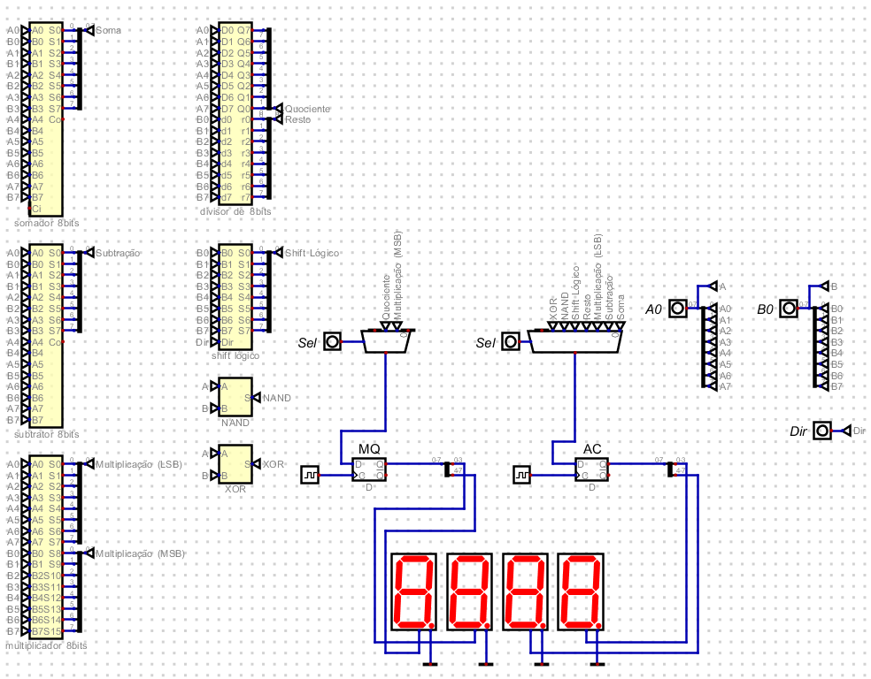

## Como executar

1. Baixe o [Digital](https://github.com/hneemann/Digital/releases)
2. Clone este repositório
3. Abra o arquivo `ALU.dig` no Digital
4. Execute a simulação com o botão Play
5. Defina os valores de A, B e o opcode conforme a tabela abaixo

| Opcode | Operação | Entrada A | Entrada B | Saída AC | Saída MQ |
|---|---|---|---|---|---|
| 000 | Soma | AC (8 bits) | N (8 bits) | Resultado | — |
| 001 | Subtração | AC (8 bits) | N (8 bits) | Resultado | — |
| 010 | Multiplicação | AC (8 bits) | N (8 bits) | 8 LSB | 8 MSB |
| 011 | Divisão | AC (8 bits) | N (8 bits) | Resto | Quociente |
| 100 | Shift lógico | AC (8 bits) | Dir (1 bit) | Resultado | — |
| 101 | NAND | AC (8 bits) | N (8 bits) | Resultado | — |
| 110 | XOR | AC (8 bits) | N (8 bits) | Resultado | — |

# Operações

## Somador

Para a soma, primeiro foi construído um Half-Adder (meia soma) com base na documentação do próprio Digital.

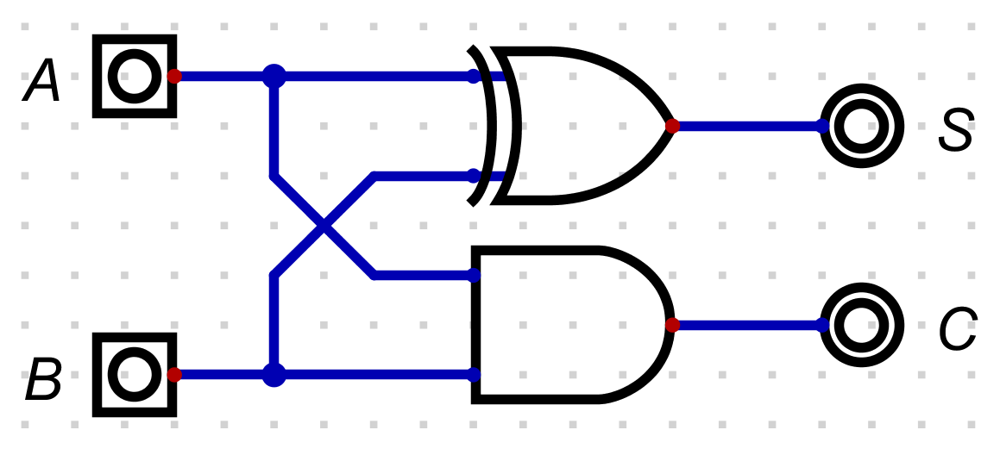

A partir disso, foi possível construir um somador inteiro utilizando de dois Half-Adders.

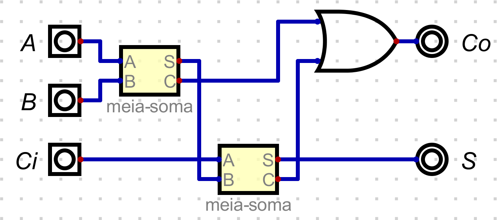

Assim, ainda seguindo a documentação do Digital, utilizei de quatro somadores completos para criar um somador de 4 bits.

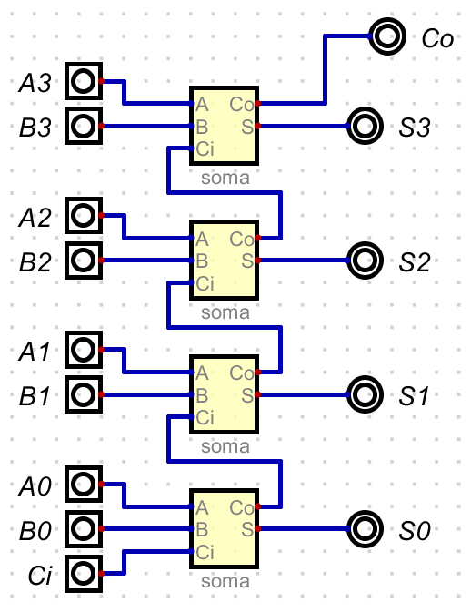

Para que fosse possível então concluir um somador de 8 bits completo, só bastava utilizar de dois somadores de 4 bits e cirar 8 entradas e 8 saídas.

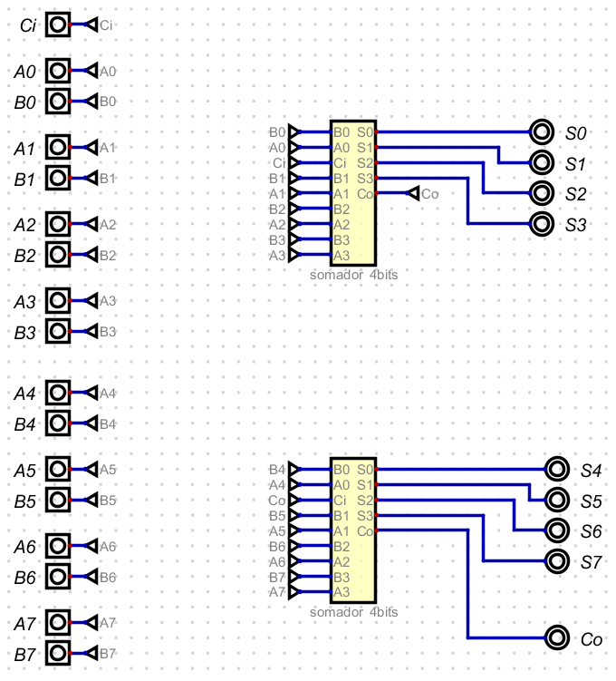

Fonte: Documentação do Digital

## Subtrator

Para construir o subtrator de 8 bits, utilizei a mesma lógica do somador, mas usando subtratores.

Primeiro, construí um meio subtrator com XOR, NOT e AND.

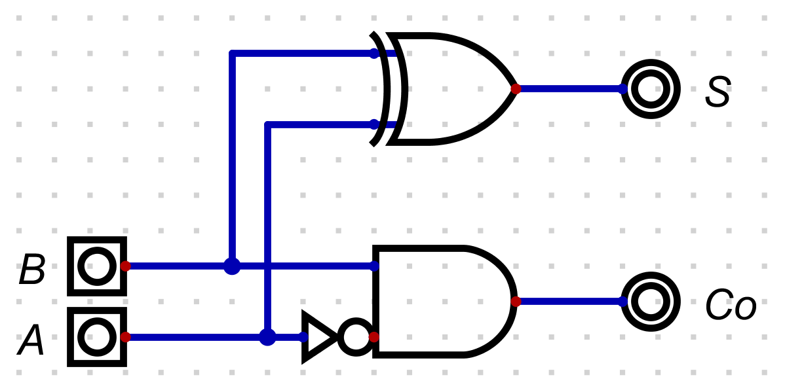

A partir disso, foi possível construir um subtrator inteiro utilizando de dois meios-subtratores.

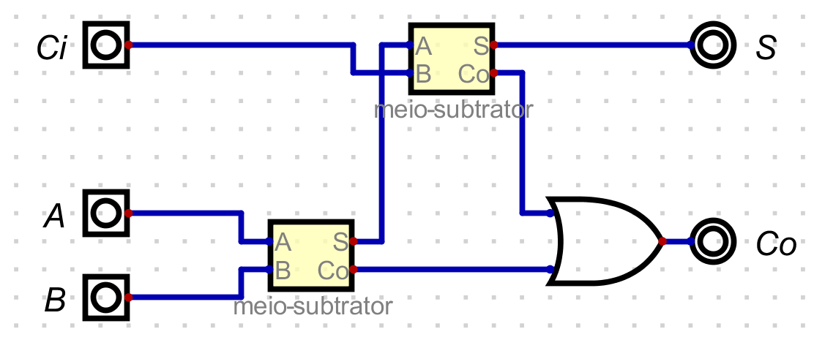

Assim, seguindo a mesma lógica do somador, utilizei de quatro subtratores completos para criar um subtrator de 4 bits.

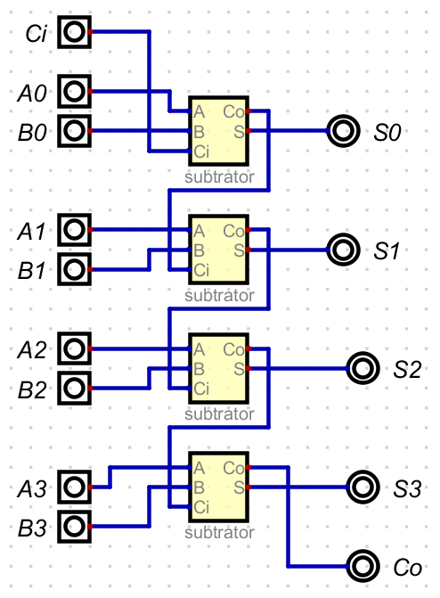

Por fim, utilizei de dois subtratores de 4 bits para escalar para um de 8 bits.

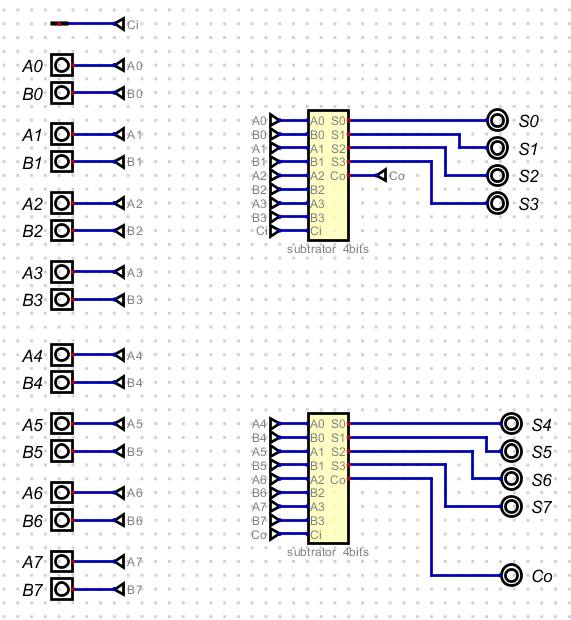

## Multiplicador

A lógica do multiplicador já foi um pouco mais complexa de entender. Assistindo ao vídeo: https://www.youtube.com/watch?v=O34KquoMpT0 consegui ter um embasamento de para onde seguir e, com base nisso, construi um pequeno esquema para me guiar na construção do circuito, como pode ser visto a baixo. 

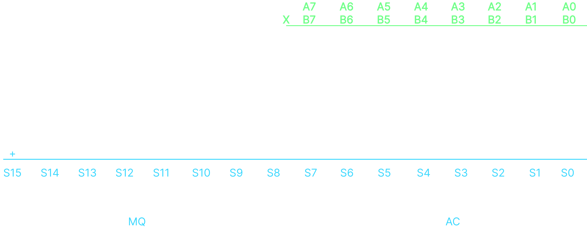

O esquema demonstra como acontece a multiplicação e o que deveria ser somado para cada uma das saídas, então assim, consegui contruir o circuito. As multiplicações ocorrem por meio de entradas AND e posteriormente, tudo é somado por meio de Full-Adders ou Half-Adders. Na etapa da adição, é importante lembrar que, para cada coluna, todos os Couts da coluna anterior também devem entrar na soma.

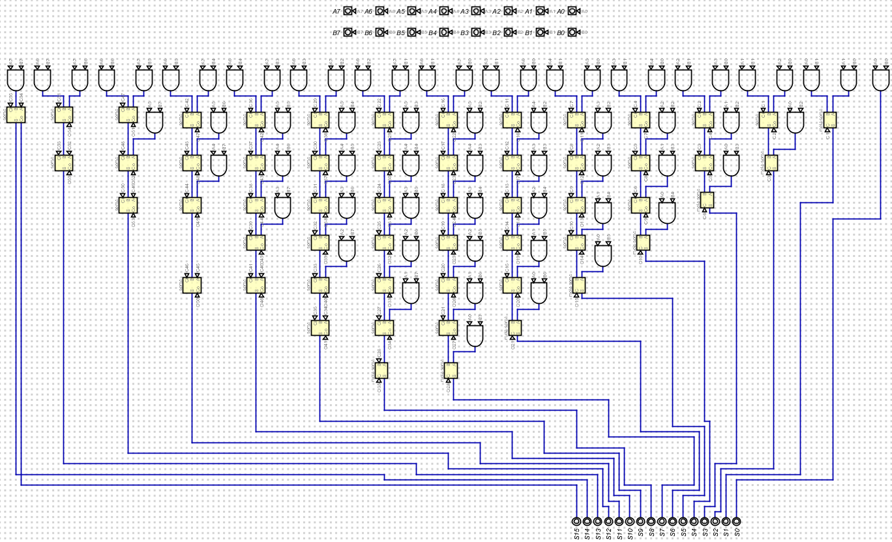

## Divisor

A lógica da Divisão de 8 bits com certeza foi a mais difícil de entender. Antes de começar o circuito, assisti o vídeo https://www.youtube.com/watch?v=joHG5yaOW5I. Por meio dele, pude compreender e visualizar a lógica da divisão através de um divisor de 5 bits por 3 bits. Com base nisso, comecei a construção do meu próprio circuito de 8 bits por 8 bits, utilizando de somadores e multiplexadores.

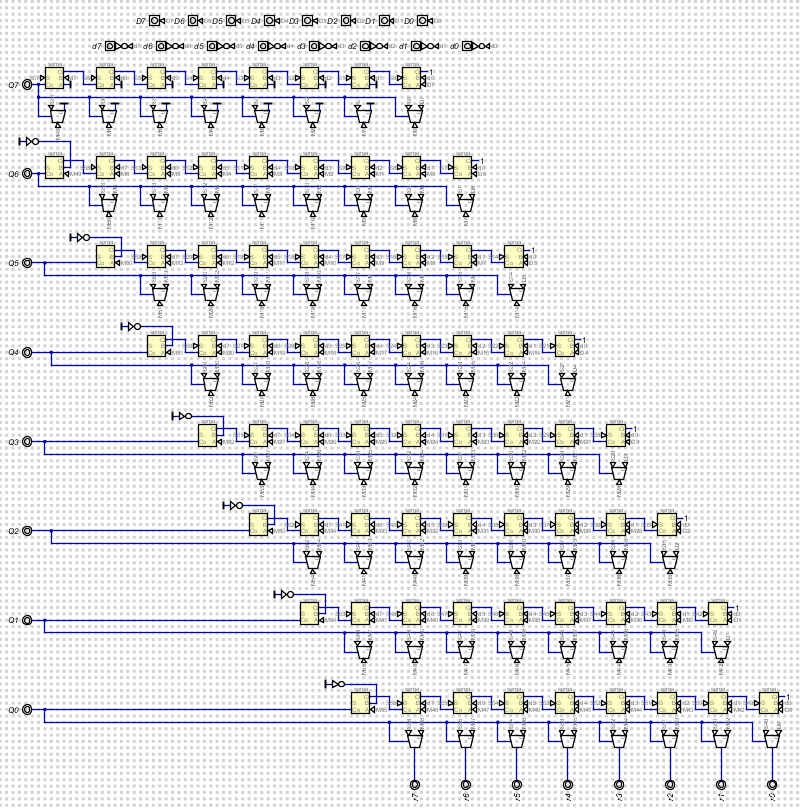

Nesse circuito temos dois tipos de saídas: Quociente e Resto.

## Shift Lógico

Para a construção do Shift Lógico, utilizei de 9 entradas, oito nomeadas de B0 até B7 e uma para dar a direção do Shift. Depois disso, criei 8 saídas e um multiplexador para cada, conectados as entradas de forma que, para uma direção (Dir = 0) multiplicasse por dois e para outra direção (Dir = 1) dividisse por dois.

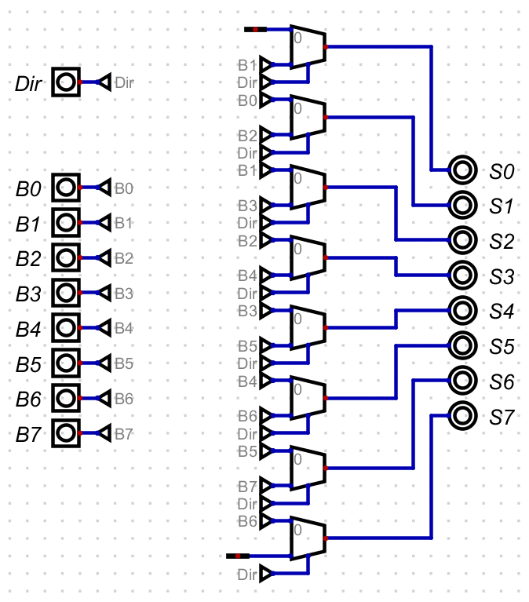

## NAND e XOR

Para o NAND e o XOR a lógica foi muito mais simples: apenas criei duas entradas de 8 bits passando por sua respectiva porta lógica e terminando em uma saída.

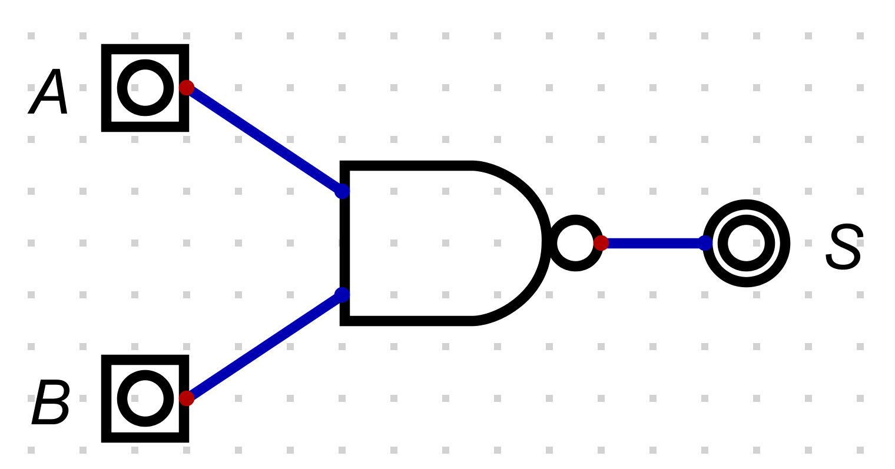

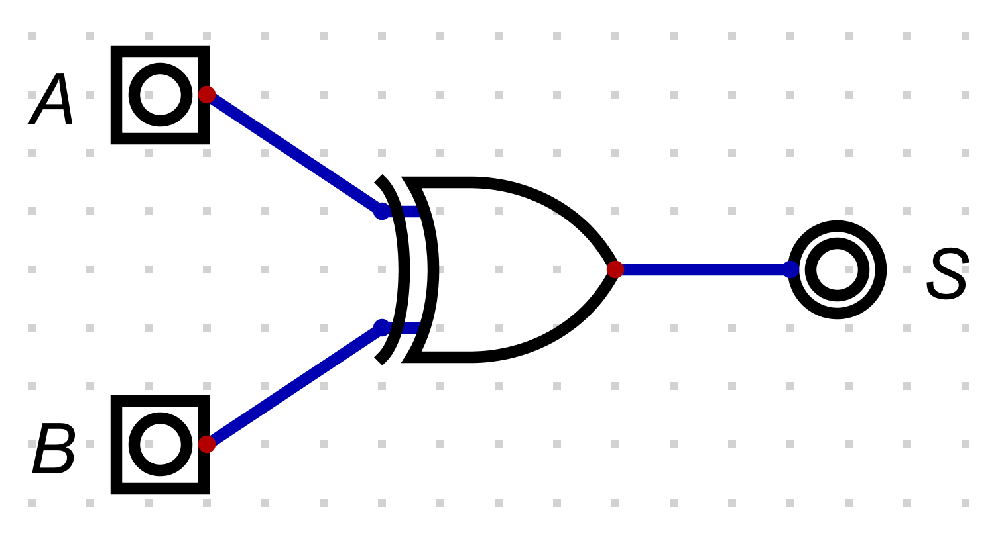

# Vídeo de apresentação

Por fim, assista ao vídeo para melhor entendimento de todo o circuito construído:
[Vídeo demonstrativo](https://youtu.be/TaeYplh--do)